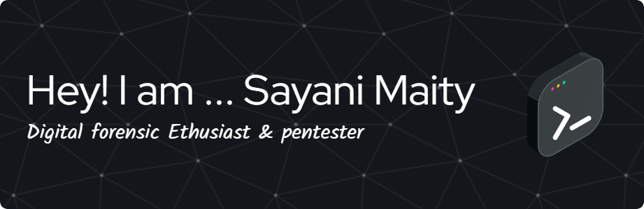

 

# 👩‍💻 To Know About Me

Hi! I'm **Sayani**, a passionate undergraduate student pursuing **B.Sc. in Digital Forensics**, with a strong foundation in **Ethical Hacking** and **Cybersecurity** from **ISOEH (Indian School Of Ethical Hacking** . I enjoy exploring new technologies, solving real-world digital investigation problems, and working on hands-on offensive and defensive security tasks.

---
Graduation session :- 
**2023-2026**
---
SGPA :-
**8.50**

---

## 🧠 Skills & Interests

- 🔐 **Digital Forensics** – Computer and Mobile Forensics, Evidence acquisition & analysis.
- 🛡️ **Penetration Testing**  
  - Android Penetration Testing (**APT**)  
  - Network Penetration Testing (**NPT**)  
  - Web Application Penetration Testing (**WAPT**)  
  - Vulnerability Assessment and Penetration Testing (**VAPT**)
- 🐍 **Python Programming** – Scripting 
- 🤖 **Machine Learning** – Applied ML in cybersecurity use cases.
- 📱 **Android Security** – Static and dynamic analysis of Android applications.
- 🌐 **Web Security** – OWASP Top 10, bug bounty methodology.
- 🕵️ **Social Engineering** – Attack simulations and human behavior exploitation.
- 🧠 **AI Prompt Engineering** – Using and designing AI prompts effectively for various tasks.

---

## 📌 Goals

- 🔬 Dive deeper into advanced forensics techniques.
- 🚀 Build and contribute to open-source tools for cybersecurity.
- 🧪 Research in AI-powered cybersecurity solutions.

---
 *“Digital Forensics🔍 isn’t just about finding the data💻 – it’s about telling the story behind it.”*

